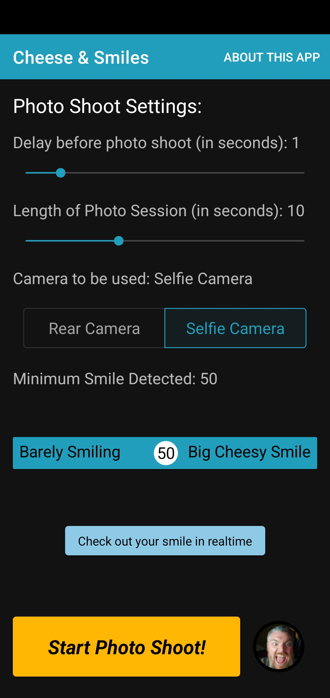
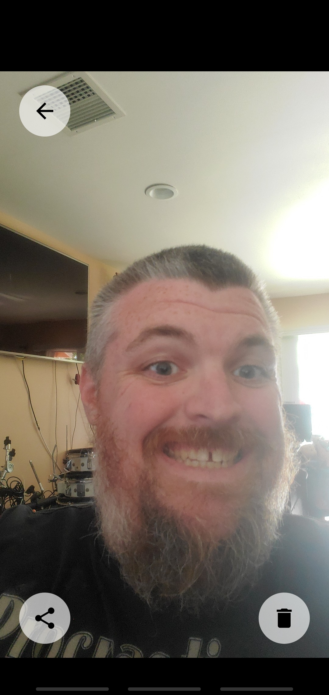
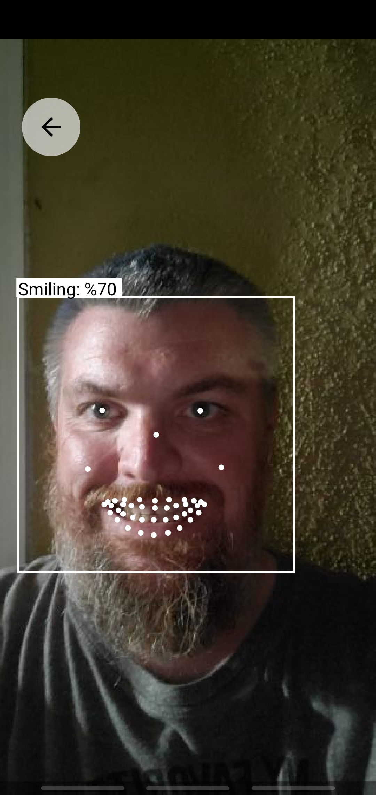

# CheeseAndSmiles

Set the camera, set the timer, get in position AND SMILE! Capture the moment when everyone is smiling!

## Getting Started

Open the Android project file in Android Studio. Then clean, build and run on a device or emulator.

## Pre-requisites

* Android Studio 3.0 or later - Latest release preferred but not necessary

* A device or emulator that runs SDK level 21 or higher

## Building
1. Open the project in Android Studio
2. Clean and build the project
3. Use the 'Play' (>) button to launch the app on a device or emulator

## Installing & Deployment
1. You can run the app in an Android emulator from Android Studio or
2. You can connect a Developer Mode enabled Android device via USB cable to your computer and run the app on the device.

## Usage

The user is presented with a screen full of settings which will effect the 'Photo Shoot' started with the bright button at the bottom of the screen.

The 'Photo Shoot' session will utilize Google's MLKit package to detect the people within the camera shot and then detect their smile on a scale of 0 (not smiling at all) to 100 (big cheesy smile). Once all people are detected to be smiling over the preset threshold, the app automatically takes a picture and saves it to external (or internal if external is unavailable) storage. 

The latest photo taken by the app is displayed on a Photo Button on the lower right hand corner of the screen and when tapped, takes the user to a gallery to view all the photos taken by the app. The gallery allows the user to share and/or delete photos.

The settings screen also includes a button which leads to a realtime example of the smile tracking done by the app.

## Versioning
Version 1.0.0

## Author
Daniel Ellis - yabomonkey@gmail.com - https://www.linkedin.com/in/daniel-ellis-yabomonkey/